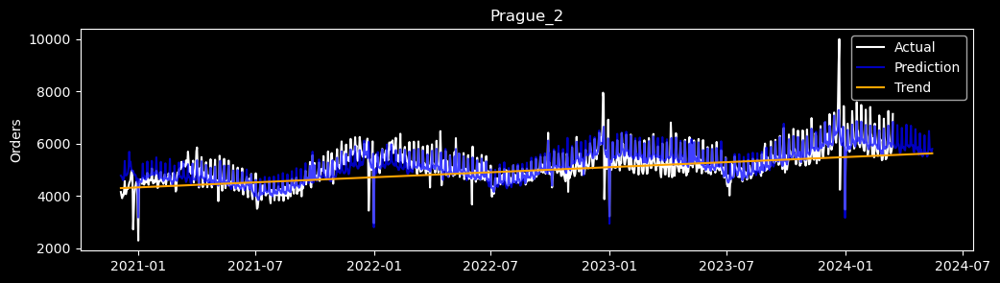
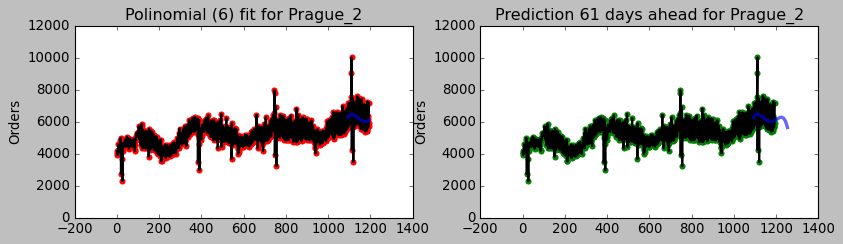
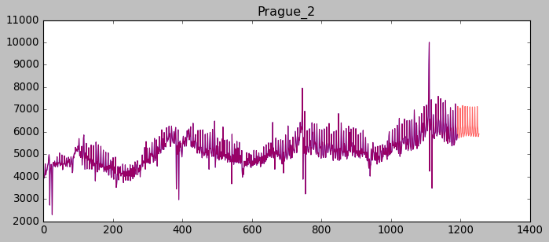
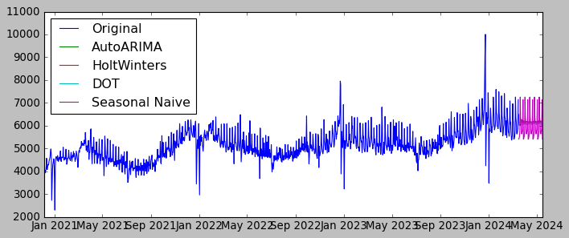

# Forecasting
A forecasting algorithm for the Rohlik Orders challenge in Kaggle: https://www.kaggle.com/competitions/rohlik-orders-forecasting-challenge

This notebook implements four different approaches to performing forecasting predictions on the number of orders in the next 61 days following the dates from the training set. The four approaches are, in order:

1. **Prophet**: https://github.com/facebook/prophet
2. **Fitting polynomials**: https://scikit-learn.org/stable/modules/generated/sklearn.preprocessing.PolynomialFeatures.html
3. **SKForecast**: https://github.com/JoaquinAmatRodrigo/skforecast
4. **StatsForecast**: https://github.com/Nixtla/statsforecast

Reference each of the tools for their particular settings and hacking. The main idea is to infer a function that continues as part of a known, probably oscillatory function in time.

In the following images a forecasting for the orders of the *Prague_2* warehouse for the next 61 days can be seen, using each of the four mentioned forecasting methods.

**Prophet** was the method that returned the best accuracy, though through enough tinkering, better scores can be achieved. The method for scoring was the **Mean Absolute Percentage Error (MAPE)**.

## Prophet

## Fitting polinomials

## SKForecast

## StatsForecast

